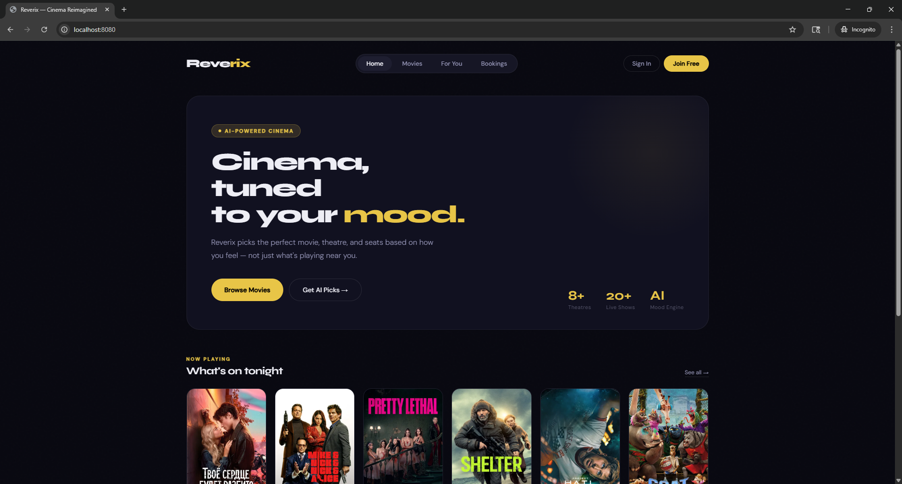
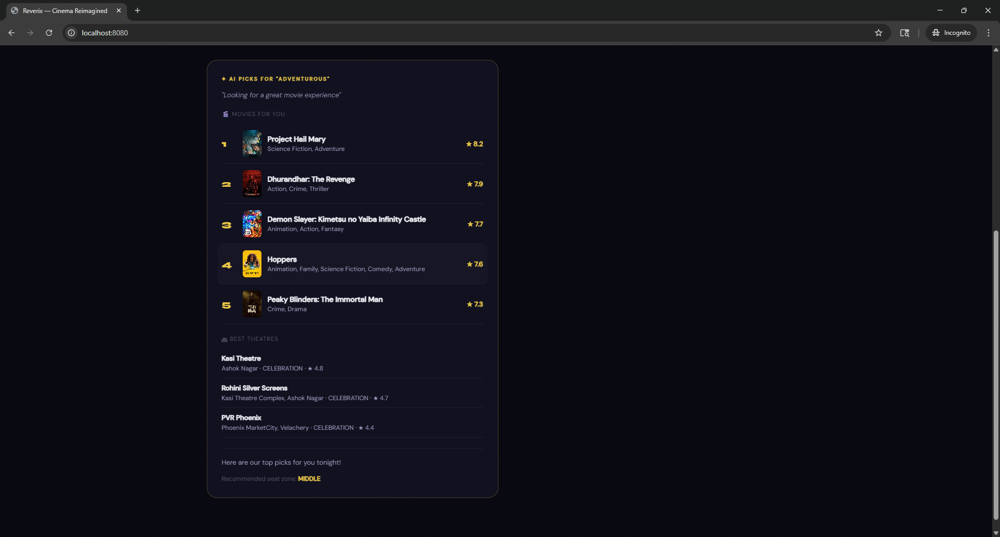

# Reverix 🎬
### AI-Powered Smart Movie Booking Platform

> "Tell me your mood — Reverix finds your perfect movie, theatre, and seat."

[](https://spring.io/projects/spring-boot)
[](https://kotlinlang.org)
[](https://mysql.com)

---

## What is Reverix?

Reverix is a smart movie booking platform that goes beyond just listing movies and seats. It understands your **mood**, your **group**, and recommends the perfect movie + theatre + seat zone — powered by AI.

Think BookMyShow meets an AI concierge.

---

## Screenshots

### Home — Cinema, tuned to your mood


### AI Picks — Mood input → Ranked results


---

## Features

### AI Mood-Based Recommendation
Tell Reverix how you feel in plain English:
- *"Feeling excited, going with 5 friends"*
- *"Romantic evening with my partner"*
- *"Family of 7, want something light"*

Reverix calls **Llama 3.3 70B via OpenRouter** to analyze your mood, match it to currently playing movies, recommend theatres by vibe, and suggest the best seat zone.

### Theatre Vibe Classification
Every theatre is classified by its personality:

| Vibe | Best For |
|------|----------|
| CELEBRATION | Group of friends, mass entertainers |
| SILENT | Solo viewers, art films |
| FAMILY | Families, animation, drama |
| DATE_NIGHT | Couples, romance |
| PREMIERE | IMAX, blockbusters |

### Group-Aware Seat Recommendation
| Group Type | Recommended Zone | Reason |
|------------|-----------------|--------|
| Friends (4+) | MIDDLE | Best group experience |
| Family | BACK | Spacious, easy exit |
| Couple | MIDDLE | Perfect view |
| Solo | MIDDLE | Best screen experience |

### CinePrime Subscription
Premium users get **early access** to tickets before general public — implemented with FIFO queue logic and role-based access control.

### Real Movie Data
Movies synced from **TMDb API** with automatic mood-tag generation based on genre classification.

---

## Tech Stack

| Layer | Technology |
|-------|-----------|
| Language | Kotlin 1.9.22 |
| Framework | Spring Boot 3.2.3 |
| Security | Spring Security + JWT |
| Database | MySQL 8 |
| Migrations | Liquibase |
| AI | OpenRouter + Llama 3.3 70B (free) |
| Movies API | TMDb |

---

## Architecture
```
Client Request
     │
     ▼
Spring Security (JWT Filter)
     │
     ▼
REST Controllers
     │
     ├── AuthController           → Register / Login
     ├── MovieController          → TMDb sync + listing
     ├── TheatreController        → Vibe-based recommendation
     ├── RecommendationController → AI mood engine
     └── BookingController        → Seat lock + confirm
     │
     ▼
Service Layer
     │
     ├── RecommendationService → OpenRouter/Llama AI call
     ├── TmdbService           → TMDb API sync
     ├── BookingService        → FIFO queue + seat locking
     └── TheatreService        → Vibe matching algorithm
     │
     ▼
MySQL Database (Liquibase migrations)
     │
     └── users / theatres / movies / shows / seats / bookings
```

---

## API Endpoints

### Auth (Public)
```
POST /api/auth/register    — Create account
POST /api/auth/login       — Get JWT token
```

### Movies (Public)
```
GET /api/movies/now-playing          — Currently showing
GET /api/movies/popular              — Popular movies
GET /api/movies/search?query=        — Search movies
GET /api/movies/{id}                 — Movie details
GET /api/movies/rentable             — Movies to rent
```

### Theatres (Public)
```
GET /api/theatres                             — All theatres
GET /api/theatres/city/{city}                — By city
GET /api/theatres/city/{city}/vibe/{vibe}    — By vibe
GET /api/theatres/recommend?city=&groupType= — Smart recommend
```

### AI Recommendation (Public)
```
POST /api/recommend
Body: {
  "mood": "excited, going with friends",
  "city": "Chennai",
  "groupType": "friends",
  "groupSize": 5,
  "preferredZone": "MIDDLE"
}
```

### Bookings (JWT Required)
```
POST   /api/bookings/lock-seats       — Lock seats (10 min)
POST   /api/bookings/confirm          — Confirm booking
DELETE /api/bookings/{id}             — Cancel booking
GET    /api/bookings/my-bookings      — Your bookings
GET    /api/bookings/recommend-seats  — Smart seat picker
```

---

## Local Setup

### Prerequisites
- Java 17
- MySQL 8
- Gradle

### Steps
```bash
# Clone the repo
git clone https://github.com/ashish-babu-03/Reverix.git
cd Reverix

# Set these in src/main/resources/application.properties
spring.datasource.url=jdbc:mysql://localhost:3306/reverix_db?createDatabaseIfNotExist=true
spring.datasource.username=root
spring.datasource.password=yourpassword
tmdb.api.key=your_tmdb_key
openrouter.api.key=your_openrouter_key
openrouter.model=meta-llama/llama-3.3-70b-instruct:free
app.jwt.secret=your_secret_key

# Run — Liquibase creates all tables automatically
./gradlew bootRun
```

Server starts at `http://localhost:8080`

---

## Key Design Decisions

**Why Liquibase over Hibernate auto-create?**
Version-controlled migrations mean any developer can clone and run with zero manual DB setup. Each changeSet is independently trackable and reversible.

**Why OpenRouter + Llama instead of GPT-4?**
Llama 3.3 70B on OpenRouter is completely free for development, follows the same OpenAI-compatible API contract, and can be swapped for any other LLM by changing one config line.

**Why ENUM columns for theatre vibe and seat zone?**
Enforces data integrity at the database level — no invalid vibe types can ever be inserted, even by direct DB access.

**Why 10-minute seat lock window?**
Mirrors real booking platforms — long enough to complete payment, short enough to prevent seat hoarding.

---

## What I Learned

- Designing multi-entity REST APIs with proper separation of concerns
- Integrating third-party APIs (TMDb, OpenRouter) with graceful fallback handling
- Implementing time-based resource locking (seat expiry)
- Version-controlled database migrations with Liquibase
- Role-based access control with Spring Security + JWT

---

## Author

**Ashish Babu Z**
- Email: ashish.babu.sde@gmail.com
- LinkedIn: [linkedin.com/in/ashish-babu-z](https://linkedin.com/in/ashish-babu-z)
- GitHub: [github.com/ashish-babu-03](https://github.com/ashish-babu-03)

---

*Built as a portfolio project to demonstrate Spring Boot + Kotlin backend engineering with AI integration.*
